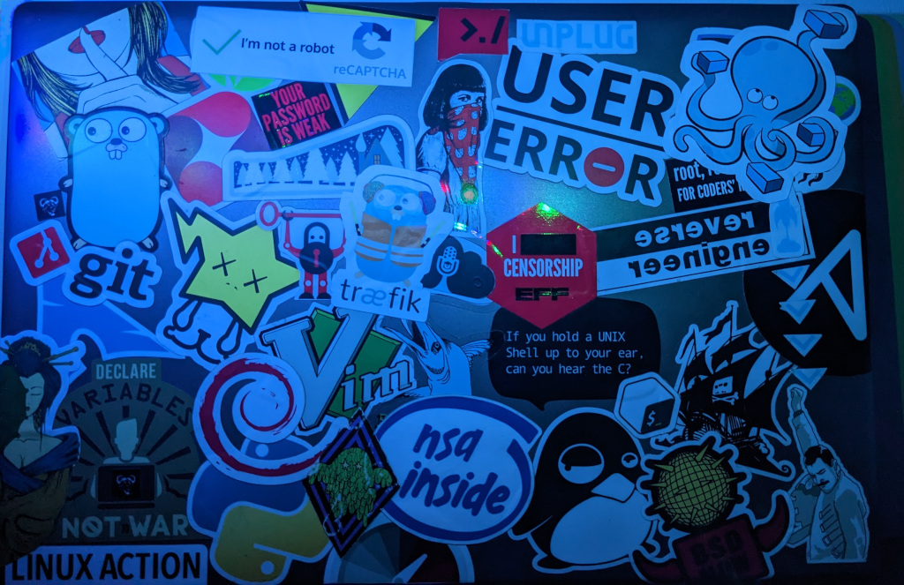

# How's It Going?

With February in full swing things are busy! at work 🧱 🔨 & home owners want early spring possesions on houses not even inspected yet 😬. I'm trying to find time to finish my [shellToNix](https://github.com/noflcl/blog/tree/main/code/nixos/shellToNix) post which is hung up due to remote decryption😑. My test nix system is my old laptop, and day to day this server is actually WiFi only which has honestly been rock solid 😸. Very little data persists on here since I use it to play around with flakes and host a few docker containers that saves their data to the main server.

The laptop is decent spec and not to mention the the laptops sticker bomb looks great on the wall beneath my monitor.  
### Specs:
  - Intel i5-6300U vPRO processor (2.4GHz, up to 3.0GHz, 3M Cache)
  - Quick Sync Video Support
  - 16GB DDR3 1600
  - Intel HD Graphics 520 (enough to run your display 🤣)
     - HDMI/DP max res (4096x2304@24Hz)
  - Intel Dual Band Wireless-AC 8260 802.11a/b/g/n/ac (2x2)
  - WiFi and Bluetooth 4.0

 

 
Here is the kicker though! the ethernet port is broken 😆, no battery, and I'm doing USB 3.0 -> ethernet for this test. 🤯 Whaaaaat! USB Ethernet? Yup, because riddle me this...

> If you have a fully encrypted disk, and no working internal ethernet port. How do you get early boot networking to remotely decrypt your server?

## 🥁 ... ... ... You Don't!

## USB networking in `boot.initrd`

You need to get networking up and going early so we hook your `boot.initrd` to handle this. For me I'm using USB Ethernet so I have to get the network interface kernel module loaded and I need to get `usbnet` loaded.

`boot.initrd.availableKernelModules = [ "usbnet" "rtsx_pci" ]`

There is much more to be done here but suffice to say I don't have early boot networking over USB yet. I'm tempted to buy a replacement ethernet port on eBay since they are like $3 + some shipping and have a proper wired interface again... This laptop is Intel all the way down and had a Gig interface. 

If I solve this issue I will be ready to move my core 3 servers over to NixOS with the confidence I have on Ubuntu right now. The first system to update will be my DNS & Ad blocking server which is full disk encrypted and wired in the networking closet.