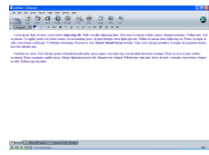
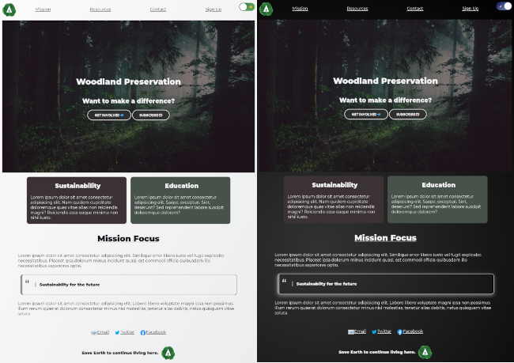
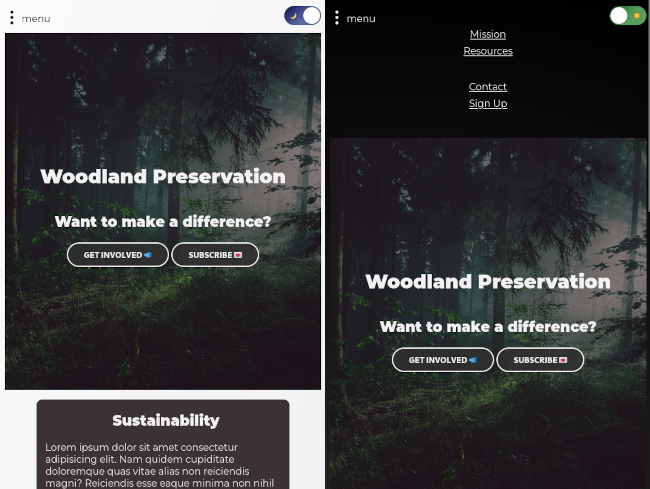
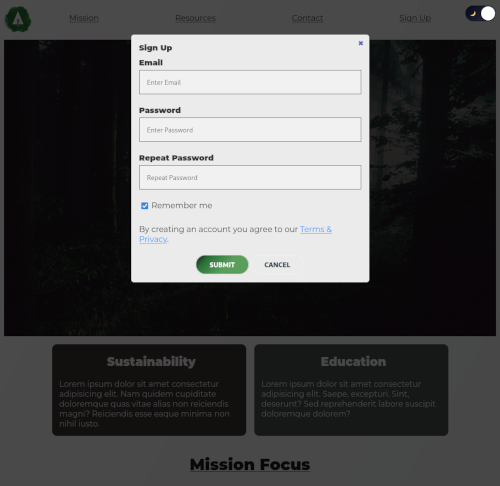

# Wrapped Up In CSS

##  📣 Alright folks, that's a wrap! 📣

A few weeks ago I started a 21 day CSS course to help me with some basics and get me thinking about the frontend. "Why is responsive web design WAY harder than it should be", turns out I was the problem 😲.

 
Okay.. That last point isn't so surprising my HTML and CSS knowledge stems from the late 90's early 2000's when I was first getting into computers, using Netscape, and building sites with Netscape Composer. Ooof the early days before having a real IDE with all the glorious features and plugins 😝.
 

There was a lot of great information in this 21 day challenge, if I'm truly honest though, the course really focused on Flexbox and didn't touch on a whole lot more. There was some extra content on typography and spacing but it wasnt focused on. There are still some massive gaps in my knowledge but I do feel a lot more confident in being able to do a quick prototype, that is mobile responsive, and have a nice navigation.

# Flexbox

Here is a sample site that I created
[Minimal Design](https://github.com/noflcl/learning/tree/main/css/minimal) up on GitHub.

Note: This is not a template and should only be used a reference.

## Minimal 
### Features:
  - Mobile first 
  - Drop down navigation menu
  - Renders even on ultrawide displays
  - Simple `day` / `night` mode toggle
  - Input forms for account Sign-Up and Newsletter (these are dummy features)
  - Stylized popups that act as overlays for user input like Sign-Up flows

<u>Desktop Site</u>

<u>Mobile /w collapsable menu</u>

<u>Sign-Up Popup Overlay</u>

